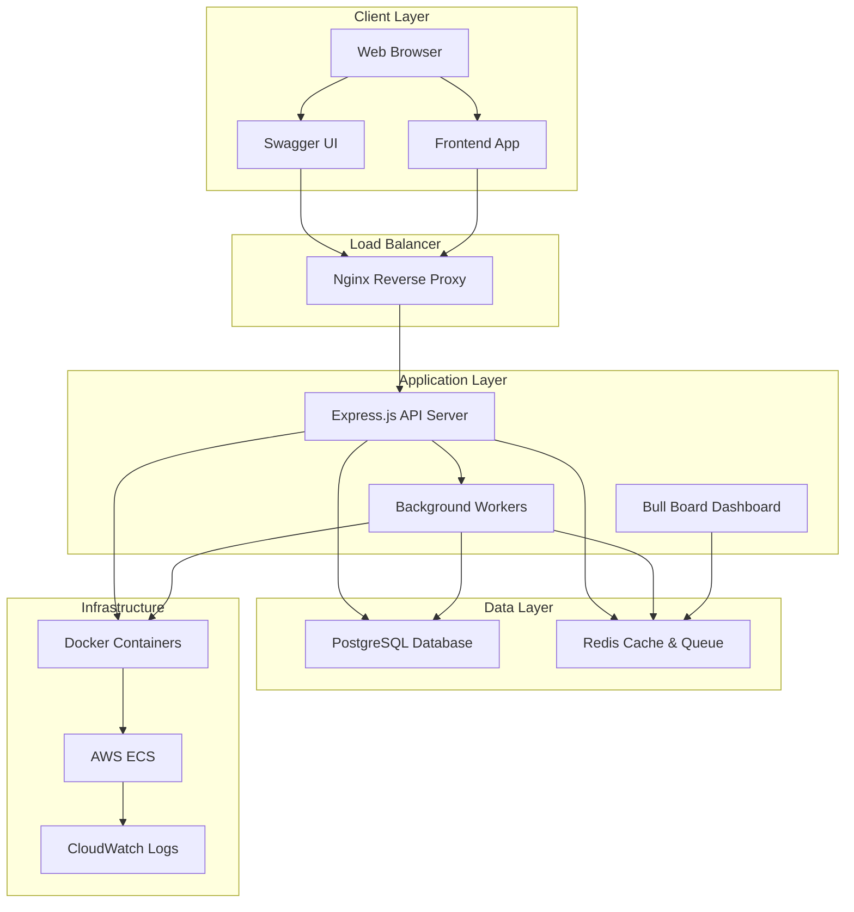
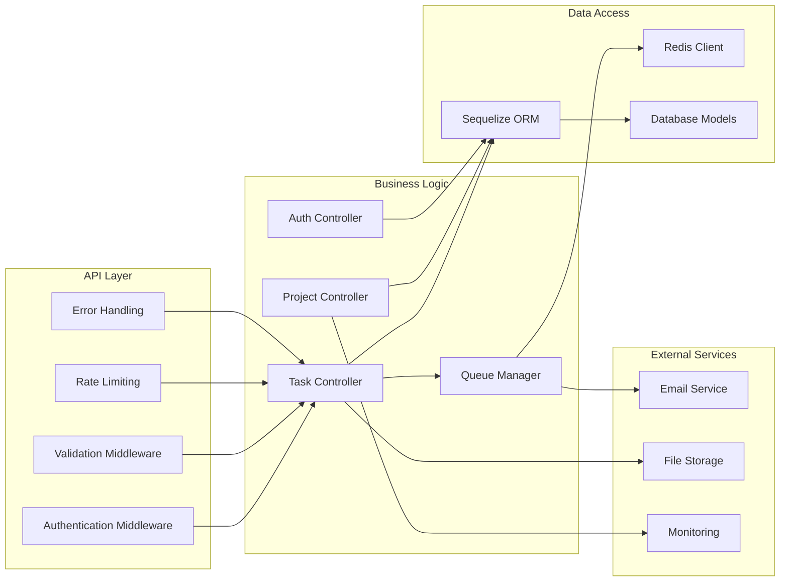
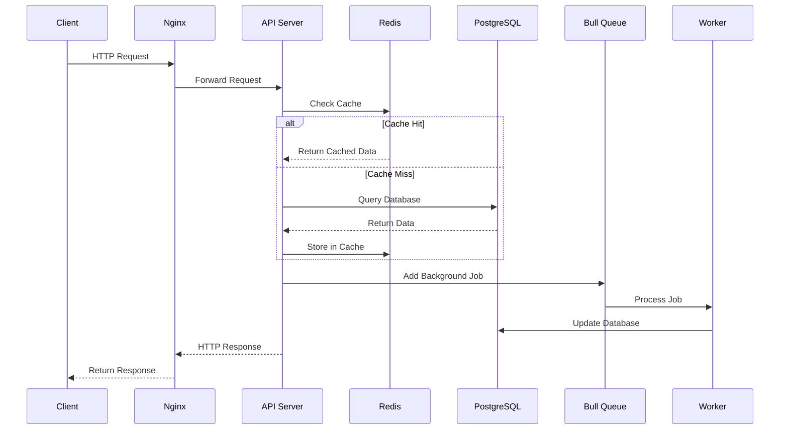

# TaskFlow Pro - System Architecture 🏗️

## High-Level Architecture

## Detailed Component Architecture

## Data Flow Diagram

## Technology Stack

### Backend
- **Node.js 16+** - Runtime environment
- **Express.js** - Web framework
- **Sequelize** - ORM for PostgreSQL
- **JWT** - Authentication tokens
- **Joi** - Input validation
- **Winston** - Logging

### Database & Caching
- **PostgreSQL 14** - Primary database
- **Redis 7** - Caching and session storage
- **Bull** - Background job processing

### Infrastructure
- **Docker** - Containerization
- **Docker Compose** - Local development
- **AWS ECS** - Production deployment
- **Nginx** - Reverse proxy and load balancer

### Documentation & Monitoring
- **Swagger/OpenAPI** - API documentation
- **Bull Board** - Queue monitoring
- **Health Checks** - Service monitoring

## Key Features Demonstrated

### 1. **Authentication & Authorization**
- JWT-based authentication
- Role-based access control
- Token refresh mechanism
- Secure password hashing

### 2. **Data Management**
- RESTful API design
- CRUD operations
- Advanced filtering and pagination
- Input validation and sanitization

### 3. **Performance Optimization**
- Redis caching layer
- Database query optimization
- Pagination for large datasets
- Background job processing

### 4. **Scalability**
- Microservices architecture
- Horizontal scaling with Docker
- Queue-based processing
- Stateless API design

### 5. **Monitoring & Observability**
- Health check endpoints
- Comprehensive logging
- Queue monitoring dashboard
- Error tracking and reporting

## Interview Talking Points

### **"How do you handle authentication?"**
- JWT tokens with short expiration
- Refresh token mechanism
- Middleware-based route protection
- Secure password hashing with bcrypt

### **"How do you ensure data consistency?"**
- Database transactions for critical operations
- Foreign key constraints
- Input validation with Joi schemas
- Soft deletes for data integrity

### **"How do you handle high traffic?"**
- Redis caching for frequently accessed data
- Pagination to limit response sizes
- Background job processing for heavy operations
- Horizontal scaling with Docker containers

### **"How do you ensure code quality?"**
- Comprehensive input validation
- Proper error handling and logging
- Unit and integration tests
- Code documentation with JSDoc

### **"How do you handle background processing?"**
- Bull queues for async operations
- Job retry mechanisms
- Queue monitoring dashboard
- Scalable worker processes

## Production Considerations

### **Security**
- HTTPS enforcement
- CORS configuration
- Rate limiting
- Input sanitization
- SQL injection prevention

### **Performance**
- Database indexing
- Query optimization
- Caching strategies
- CDN integration
- Load balancing

### **Monitoring**
- Application metrics
- Database performance
- Queue monitoring
- Error tracking
- Uptime monitoring

### **Deployment**
- Blue-green deployments
- Database migrations
- Environment configuration
- Secret management
- Backup strategies
